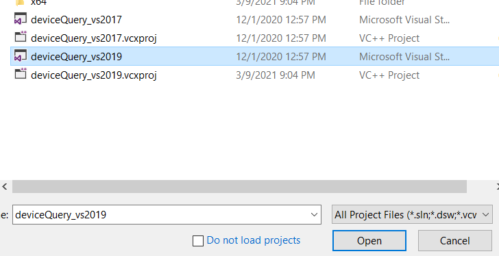
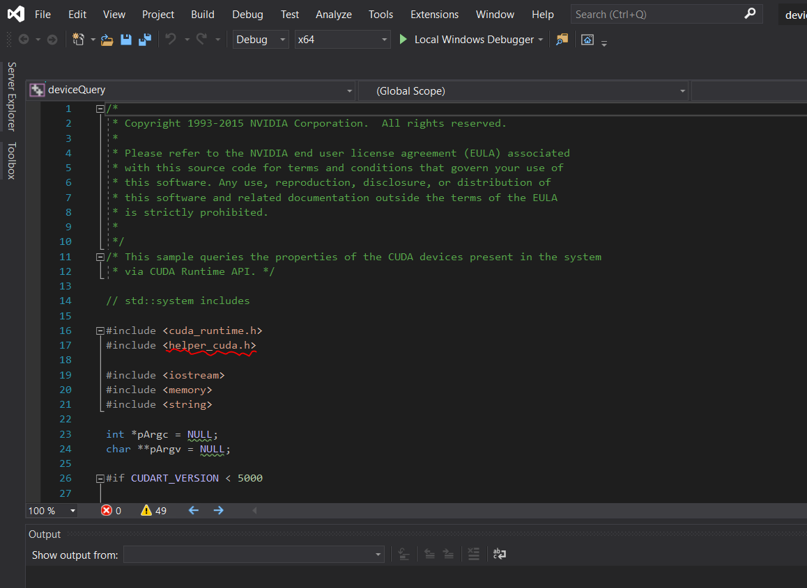
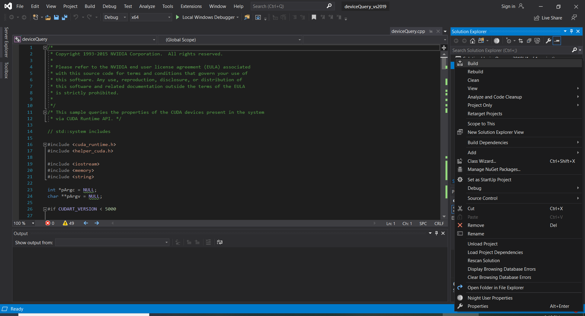
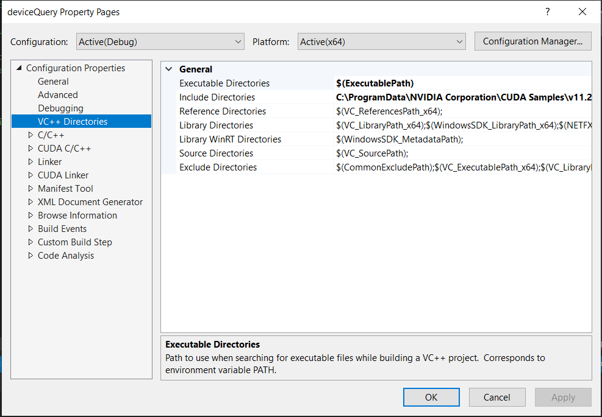
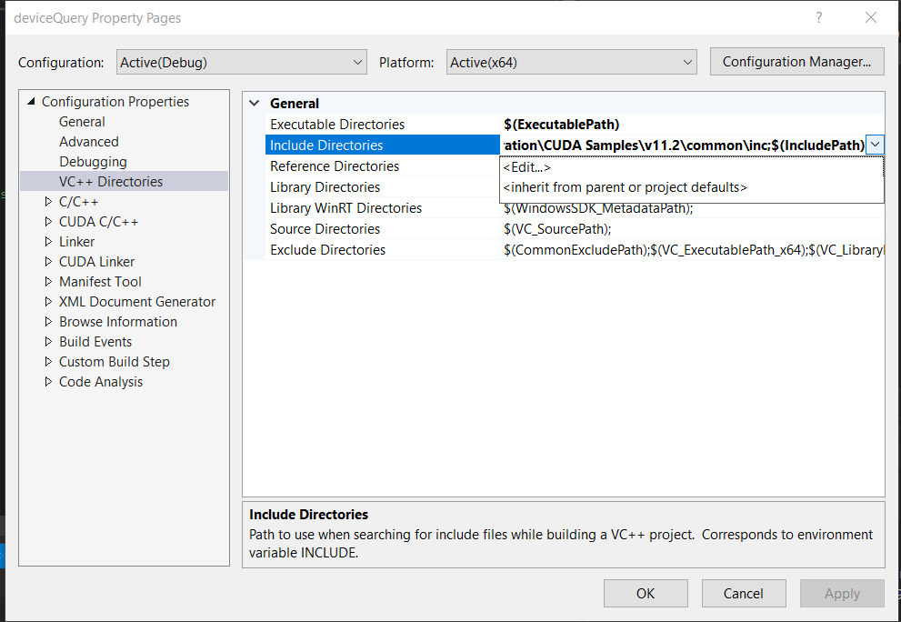
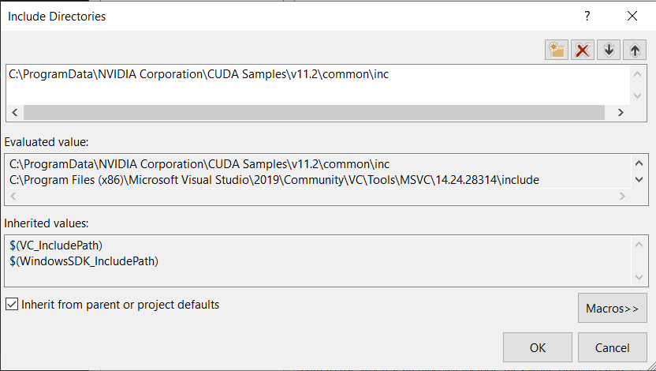
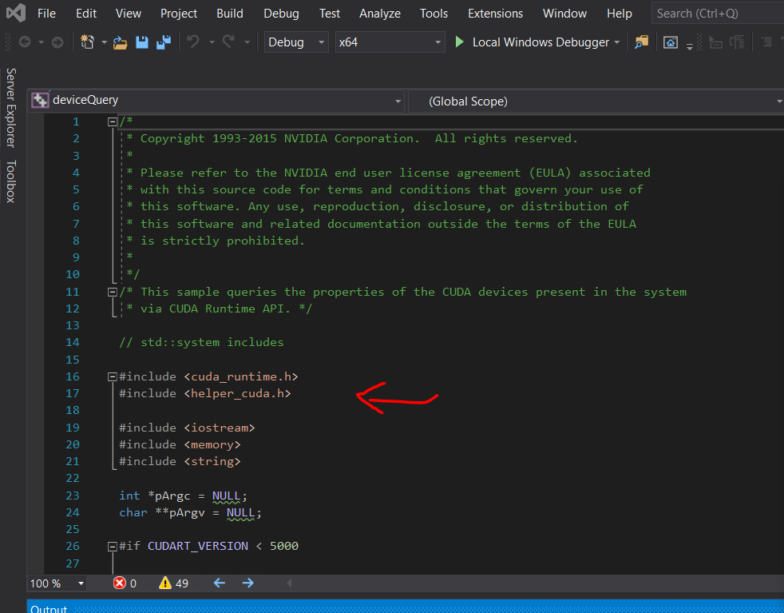
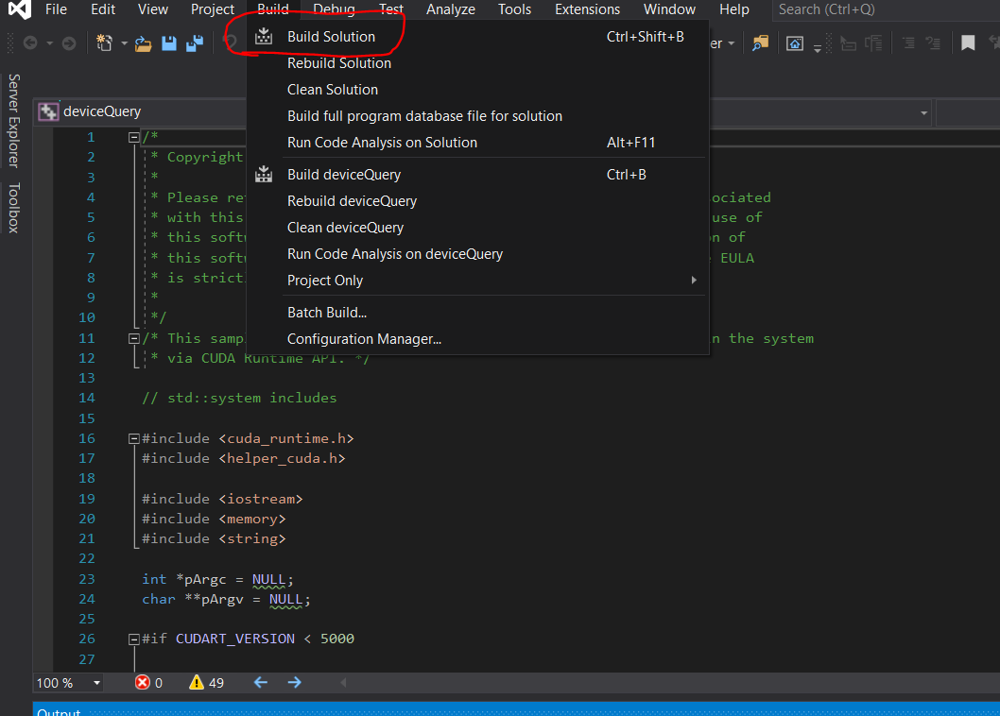

# Building-deviceQuery-CUDA-Sample-Windows-10

nVidia CUDA installation guide for Windows - 2.5 verifying the installation  
Requires you to build the deviceQuery.exe.  Here's the procedure using Visual Studio 2019

## Copy files to VS Studio project folder
Goto C:\ProgramData\NVIDIA Corporation\CUDA Samples\v8.0\1_Utilities\deviceQuery.  You may need to unhide \ProgramData if it is not visible.
Copy the folder to your VS Studio project folder.  For my case, it is:  
C:\Users\User\Documents\Visual Studio 2019\nVidia Project

## Launch Visual Studio 2019

Then look for deviceQuery_vs2019.sln

Click to open deviceQuery.cpp file in Solution Explorer

Notice < helper_cuda.h> is underlined in red.  The pciture doesn't show the actual red underline because I had already build the solution.

Right click the project name deviceQuery in Solution Explorer and go all the way down to the bottom and select Properties

This will appear

In the left panel, select VC+ + Directories, then in the main panel, select Include Directories.  Click on the small down arrow and the end of the line.

Add this line: C:\ProgramData\NVIDIA Corporation\CUDA Samples\v8.0\common\inc

Apply and OK

Note that the red underline < helper_cuda.h> has disappeared

Select Build from the menu bar and Build Solution

Five files: deviceQuery.exe, deviceQuery.lib, deviceQuery.exp, deviceQuery.ilk, and deviceQuery.pdb  will be generated in the directory C:\Users\User\Documents\Visual Studio 2019\bin\win64\Debug

Run the deviceQuery.exe to verify your CUDA installation

