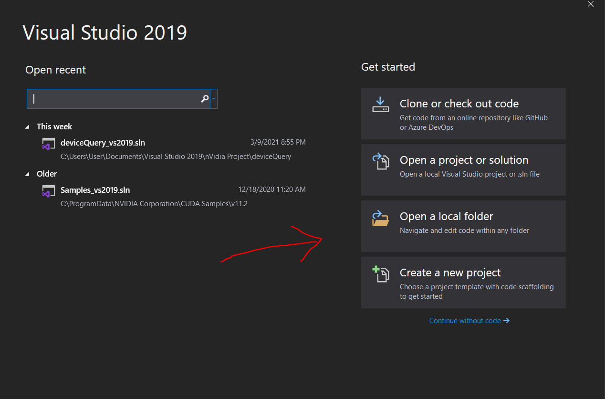

# Building-deviceQuery-CUDA-Sample-Windows-10

nVidia CUDA installation guide for Windows - 2.5 verifying the installation  
Requires you to build the deviceQuery.exe.  Here's the procedure using Visual Studio 2019

## Copy files to VS Studio project folder
Goto C:\ProgramData\NVIDIA Corporation\CUDA Samples\v8.0\1_Utilities\deviceQuery.  You may need to unhide \ProgramData if it is not visible.
Copy the folder to your VS Studio project folder.  For my case, it is:  
C:\Users\User\Documents\Visual Studio 2019\nVidia Project

## Launch Visual Studio 2019

Then look for deviceQuery_vs2019.sln

Click to open deviceQuery.cpp file in Solution Explorer

